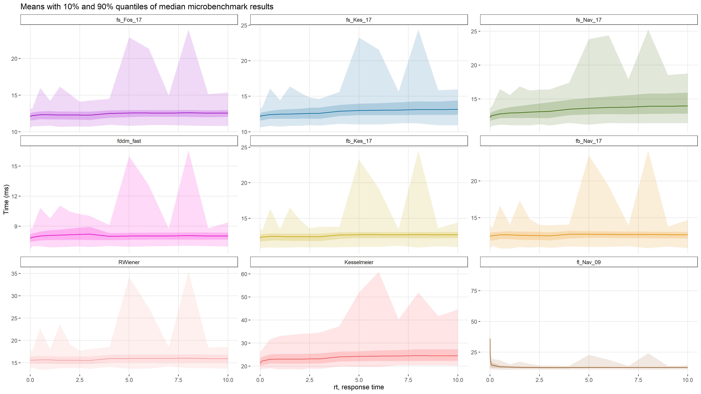
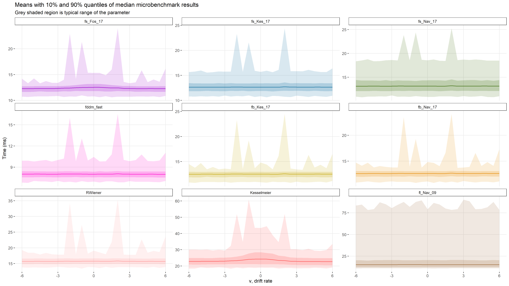

```{r setup, include=FALSE}
knitr::opts_chunk$set(
  collapse = TRUE,
  comment = "#>"
)
library(fddm)
```

# Example Uses for dfddm {.tabset .tabset-fade}

`dfddm` is a density function for the Ratcliff diffusion decision model (DDM) with following parameters: `a` (threshold separation), `v` (drift rate), `t0` (non-decision time/response time constant), `w` (relative starting point), and `sv` (inter-trial-variability of drift).


## Benchmark Tests

This section shows the results of the benchmark tests that were performed to evaluate the speed of each method. The consistency across the different methods is shown in the Validity vignette.

We want to determine the performance of each method across a wide variety of parameters in order to identify any slow areas for individual methods. To achieve this rigor, we define an extensive parameter space (in full in the code chunk below) and loop through each combination of parameters. We have two different ways of inputting the response times to the functions: either as a vector of response times or as individual response times. For each combination, we run `microbenchmark` 10,000 times for each method and only save the median benchmark time of these 10,000. The following code chunk defines the benchmarking functions, and the one after runs the full benchmark tests; but running the full tests takes a looooong while so we'll just read the data from file later on.
```{r bm-fun, eval=FALSE}
library("microbenchmark")
library("rtdists")
library("RWiener")
library("devtools")
load_all(recompile = TRUE)
library("fddm")
source(system.file("extdata", "Kesselmeier_density.R", package = "fddm", mustWork = TRUE))


####################### Constant Drift Rate
bm <- function(RT, resp, V, A, W, t0 = 1e-4, err_tol = 1e-6,
               times = 1000, unit = "us")
{
  if (resp < 0.5) {
    rresp <- "lower"
  } else {
    rresp <- "upper"
  }

  fnames <- c("fs_Fos_17", "fs_Fos_14",
              "fs_Kes_17", "fs_Kes_14", "fs_Nav_17", "fs_Nav_14",
              "fb_Kes_17", "fb_Kes_14", "fb_Nav_17", "fb_Nav_14",
              "fl_Nav_09", "RWiener", "Kesselmeier", "rtdists")
  nf <- length(fnames) # number of functions being benchmarked
  nRT <- length(RT) # number of response times
  nV <- length(V) # number of drift rates
  nA <- length(A) # number of boundary separations
  nW <- length(W) # number of starting points

  # Initialize the dataframe to contain the microbenchmark results
  mbm_res <- data.frame(matrix(ncol = 4+nf, nrow=nRT*nV*nA*nW))
  colnames(mbm_res) <- c('RT', 'V', 'A', 'W', fnames)
  row_idx <- 1

  # Loop through each combination of parameters and record microbenchmark results
  for (rt in 1:nRT) {
    for (v in 1:nV) {
      for (a in 1:nA) {
        for (w in 1:nW) {
          mbm <- microbenchmark(
            # fddm_fast = dfddm_fast(rt = RT[rt], a = A[a], v = V[v], t0 = t0,
            #                        w = W[w], err_tol = err_tol),
            fs_Fos_17 = dfddm(rt = RT[rt], response = resp, a = A[a],
                              v = V[v], t0 = t0, w = W[w],
                              log = FALSE, n_terms_small = "Foster",
                              summation_small = "2017", scale = "small",
                              err_tol = err_tol),
            fs_Fos_14 = dfddm(rt = RT[rt], response = resp, a = A[a],
                              v = V[v], t0 = t0, w = W[w],
                              log = FALSE, n_terms_small = "Foster",
                              summation_small = "2014", scale = "small",
                              err_tol = err_tol),
            fs_Kes_17 = dfddm(rt = RT[rt], response = resp, a = A[a],
                              v = V[v], t0 = t0, w = W[w],
                              log = FALSE, n_terms_small = "Kesselmeier",
                              summation_small = "2017", scale = "small",
                              err_tol = err_tol),
            fs_Kes_14 = dfddm(rt = RT[rt], response = resp, a = A[a],
                              v = V[v], t0 = t0, w = W[w],
                              log = FALSE, n_terms_small = "Kesselmeier",
                              summation_small = "2014", scale = "small",
                              err_tol = err_tol),
            fs_Nav_17 = dfddm(rt = RT[rt], response = resp, a = A[a],
                              v = V[v], t0 = t0, w = W[w],
                              log = FALSE, n_terms_small = "Navarro",
                              summation_small = "2017", scale = "small",
                              err_tol = err_tol),
            fs_Nav_14 = dfddm(rt = RT[rt], response = resp, a = A[a],
                              v = V[v], t0 = t0, w = W[w],
                              log = FALSE, n_terms_small = "Navarro",
                              summation_small = "2014", scale = "small",
                              err_tol = err_tol),
            fb_Kes_17 = dfddm(rt = RT[rt], response = resp, a = A[a],
                              v = V[v], t0 = t0, w = W[w],
                              log = FALSE, n_terms_small = "Kesselmeier",
                              summation_small = "2017", scale = "both",
                              err_tol = err_tol),
            fb_Kes_14 = dfddm(rt = RT[rt], response = resp, a = A[a],
                              v = V[v], t0 = t0, w = W[w],
                              log = FALSE, n_terms_small = "Kesselmeier",
                              summation_small = "2014", scale = "both",
                              err_tol = err_tol),
            fb_Nav_17 = dfddm(rt = RT[rt], response = resp, a = A[a],
                              v = V[v], t0 = t0, w = W[w],
                              log = FALSE, n_terms_small = "Navarro",
                              summation_small = "2017", scale = "both",
                              err_tol = err_tol),
            fb_Nav_14 = dfddm(rt = RT[rt], response = resp, a = A[a],
                              v = V[v], t0 = t0, w = W[w],
                              log = FALSE, n_terms_small = "Navarro",
                              summation_small = "2014", scale = "both",
                              err_tol = err_tol),
            fl_Nav_09 = dfddm(rt = RT[rt], response = resp, a = A[a],
                              v = V[v], t0 = t0, w = W[w],
                              log = FALSE, n_terms_small = "",
                              summation_small = "", scale = "large",
                              err_tol = err_tol),
            RWiener = dwiener(RT[rt], resp = rresp, alpha = A[a],
                              delta = V[v], tau = t0, beta = W[w],
                              give_log = FALSE),
            Kesselmeier = fs14_R(t = RT[rt]-t0, a = A[a], v = V[v],
                                 w = W[w], eps = err_tol), # only "lower" resp
            rtdists = ddiffusion(RT[rt], rresp, a = A[a], v = V[v],
                                 t0 = t0, z = W[w]*A[a]),
            times = times, unit = unit)
          # add the rt, v, a, and w values to the dataframe
          mbm_res[row_idx, 1] <- RT[rt]
          mbm_res[row_idx, 2] <- V[v]
          mbm_res[row_idx, 3] <- A[a]
          mbm_res[row_idx, 4] <- W[w]
          # add the median microbenchmark results to the dataframe
          for (i in 1:nf) {
            mbm_res[row_idx, 4+i] <- median(subset(mbm, expr==fnames[i])$time)
          }
          # iterate start value
          row_idx = row_idx + 1
        }
      }
    }
  }
  return(mbm_res)
}


bm_vec <- function(RT, resp, V, A, W, t0 = 1e-4, err_tol = 1e-6,
                   times = 1000, unit = "us")
{
  if (resp < 0.5) {
    rresp <- "lower"
  } else {
    rresp <- "upper"
  }

  fnames <- c("fs_Fos_17", "fs_Fos_14",
              "fs_Kes_17", "fs_Kes_14", "fs_Nav_17", "fs_Nav_14",
              "fb_Kes_17", "fb_Kes_14", "fb_Nav_17", "fb_Nav_14",
              "fl_Nav_09", "RWiener", "Kesselmeier", "rtdists")
  nf <- length(fnames) # number of functions being benchmarked
  nV <- length(V) # number of drift rates
  nA <- length(A) # number of boundary separations
  nW <- length(W) # number of starting points
  rresp <- rep(rresp, length(RT)) # for RWiener

  # Initialize the dataframe to contain the microbenchmark results
  mbm_res <- data.frame(matrix(ncol = 3+nf, nrow = nV*nA*nW))
  colnames(mbm_res) <- c('V', 'A', 'W', fnames)
  row_idx <- 1

  # Loop through each combination of parameters and record microbenchmark results
  for (v in 1:nV) {
    for (a in 1:nA) {
      for (w in 1:nW) {
        mbm <- microbenchmark(
          # fddm_fast = dfddm_fast(rt = RT, a = A[a], v = V[v], t0 = t0,
          #                        w = W[w], err_tol = err_tol),
          fs_Fos_17 = dfddm(rt = RT, response = resp, a = A[a],
                            v = V[v], t0 = t0, w = W[w],
                            log = FALSE, n_terms_small = "Foster",
                            summation_small = "2017", scale = "small",
                            err_tol = err_tol),
          fs_Fos_14 = dfddm(rt = RT, response = resp, a = A[a],
                            v = V[v], t0 = t0, w = W[w],
                            log = FALSE, n_terms_small = "Foster",
                            summation_small = "2014", scale = "small",
                            err_tol = err_tol),
          fs_Kes_17 = dfddm(rt = RT, response = resp, a = A[a],
                            v = V[v], t0 = t0, w = W[w],
                            log = FALSE, n_terms_small = "Kesselmeier",
                            summation_small = "2017", scale = "small",
                            err_tol = err_tol),
          fs_Kes_14 = dfddm(rt = RT, response = resp, a = A[a],
                            v = V[v], t0 = t0, w = W[w],
                            log = FALSE, n_terms_small = "Kesselmeier",
                            summation_small = "2014", scale = "small",
                            err_tol = err_tol),
          fs_Nav_17 = dfddm(rt = RT, response = resp, a = A[a],
                            v = V[v], t0 = t0, w = W[w],
                            log = FALSE, n_terms_small = "Navarro",
                            summation_small = "2017", scale = "small",
                            err_tol = err_tol),
          fs_Nav_14 = dfddm(rt = RT, response = resp, a = A[a],
                            v = V[v], t0 = t0, w = W[w],
                            log = FALSE, n_terms_small = "Navarro",
                            summation_small = "2014", scale = "small",
                            err_tol = err_tol),
          fb_Kes_17 = dfddm(rt = RT, response = resp, a = A[a],
                            v = V[v], t0 = t0, w = W[w],
                            log = FALSE, n_terms_small = "Kesselmeier",
                            summation_small = "2017", scale = "both",
                            err_tol = err_tol),
          fb_Kes_14 = dfddm(rt = RT, response = resp, a = A[a],
                            v = V[v], t0 = t0, w = W[w],
                            log = FALSE, n_terms_small = "Kesselmeier",
                            summation_small = "2014", scale = "both",
                            err_tol = err_tol),
          fb_Nav_17 = dfddm(rt = RT, response = resp, a = A[a],
                            v = V[v], t0 = t0, w = W[w],
                            log = FALSE, n_terms_small = "Navarro",
                            summation_small = "2017", scale = "both",
                            err_tol = err_tol),
          fb_Nav_14 = dfddm(rt = RT, response = resp, a = A[a],
                            v = V[v], t0 = t0, w = W[w],
                            log = FALSE, n_terms_small = "Navarro",
                            summation_small = "2014", scale = "both",
                            err_tol = err_tol),
          fl_Nav_09 = dfddm(rt = RT, response = resp, a = A[a],
                            v = V[v], t0 = t0, w = W[w],
                            log = FALSE, n_terms_small = "",
                            summation_small = "", scale = "large",
                            err_tol = err_tol),
          RWiener = dwiener(RT, resp = rresp, alpha = A[a],
                            delta = V[v], tau = t0, beta = W[w],
                            give_log = FALSE),
          Kesselmeier = fs14_R(t = RT-t0, a = A[a], v = V[v],
                               w = W[w], eps = err_tol), # only "lower" resp
          rtdists = ddiffusion(RT, rresp, a = A[a], v = V[v],
                               t0 = t0, z = W[w]*A[a]),
          times = times, unit = unit)
        # add the v, a, and w values to the dataframe
        mbm_res[row_idx, 1] <- V[v]
        mbm_res[row_idx, 2] <- A[a]
        mbm_res[row_idx, 3] <- W[w]
        # add the median microbenchmark results to the dataframe
        for (i in 1:nf) {
          mbm_res[row_idx, 3+i] <- median(subset(mbm, expr==fnames[i])$time)
        }
        # iterate start value
        row_idx = row_idx + 1
      }
    }
  }
  return(mbm_res)
}

####################### Wrapper for Benchmarks #################################
rt_benchmark <- function(RT, resp, V, A, W, t0 = 1e-4, err_tol = 1e-6,
                         rt_as_vec = FALSE, times = 1000, unit = "us")
{
  if (rt_as_vec) { # benchmark all rt's as a vector
    return(bm_vec(RT = RT, resp = resp, V = V, A = A, W = W, t0 = t0,
                  err_tol = err_tol, times = times, unit = unit))
  } else { # benchmark each rt individually
    return(bm(RT = RT, resp = resp, V = V, A = A, W = W, t0 = t0,
              err_tol = err_tol, times = times, unit = unit))
  }
}
```

```{r bm-run, eval=FALSE}
# Define parameter space
RT_0_30 = c(0.001, 0.005, 0.01, 0.05, 0.1,
            seq(0.5, 3, by = 0.5),
            seq(4, 10, by = 1),
            seq(12.5, 20, by = 2.5),
            seq(25, 30, by = 5))
RT_0_3 = c(0.001, 0.005, 0.01, 0.05, 0.1,
           seq(0.5, 3, by = 0.5))
RT_4_10 = seq(4, 10, by = 1)
RT_12_30 = c(seq(12.5, 20, by = 2.5),
             seq(25, 30, by = 5))
A = c(0.25, seq(0.5, 5, by = 0.5))
V = seq(-6, 6, by = 0.5)
t0 = 1e-4 # must be nonzero for RWiener
W = seq(0.2, 0.8, by = 0.1)
err_tol = 1e-6 # this is the setting from rtdists

# Run benchmark tests
sim <- rt_benchmark(RT = RT_4_10, resp = 0, V = V, A = A, W = W, t0 = t0,
                    err_tol = err_tol, rt_as_vec = FALSE,
                    times = 10000, unit = "us")
saveRDS(sim, file = "data/sim_4-10_10000.Rds")

sim_vec <- rt_benchmark(RT = c(RT_0_3, RT_4_10), resp = 0, V = V, A = A, W = W, t0 = t0,
                        err_tol = err_tol, rt_as_vec = TRUE,
                        times = 10000, unit = "us")
saveRDS(sim_vec, file = "data/vec_0-10_10000.Rds")
```

<br>
The first step in analyzing the benchmark data is to visualize the results in side-by-side violin plots that show the distribution of `microbenchmark` timings. We read the results data from the file and plot a violin for each method investigated. For this visualization we will use the benchmark data where the response times are input as a vector to each function; this should help the the mainly `R`-based functions operate more efficiently because of `R`'s use of vectorization. The following code chunk saves violin plots of the benchmark results (can take a short while).
```{r bm-violin, eval=FALSE}
library("reshape2")
library("ggplot2")

bm <- readRDS("data/vec_0-10_10000.Rds")
t_idx <- match("W", colnames(bm))
bm[,-seq_len(t_idx)] <- bm[, -seq_len(t_idx)]/1000
mbm <- melt(bm, measure.vars = -seq_len(t_idx),
            variable.name = "FuncName", value.name = "time")

Names <- c("fddm_fast", "fs_Fos_17", "fs_Fos_14",
           "fs_Kes_17", "fs_Kes_14", "fs_Nav_17", "fs_Nav_14",
           "fb_Kes_17", "fb_Kes_14", "fb_Nav_17", "fb_Nav_14",
           "fl_Nav_09", "RWiener", "Kesselmeier", "rtdists")
Color <- c("#ff00cc", "#9900cc", "#cc99ff",
           "#006699", "#66ccff", "#336600", "#33cc33",
           "#c2a500", "#d7db42", "#e68a00", "#ffb366",
           "#996633", "#ff9999", "#ff5050", "#990000")

violin <- ggplot(mbm, aes(x = FuncName, y = time,
                          color = factor(FuncName, levels = Names),
                          fill = factor(FuncName, levels = Names))) +
                 geom_violin(trim = TRUE, alpha = 0.5) +
                 scale_color_manual(values = Color) +
                 scale_fill_manual(values = Color) +
                 geom_boxplot(width = 0.15, fill = "white", alpha = 0.5) +
                 stat_summary(fun.y = mean, geom = "errorbar",
                              aes(ymax = ..y.., ymin = ..y..),
                              width = .35, linetype = "dashed") +
                 # abline
                 coord_cartesian(ylim = c(0,50)) +
                 labs(title = "Distribution of median benchmark times",
                      subtitle = "Dashed lines represent mean benchmark times",
                      x = "Method", y = "Time (ms)",
                      color = "Method") +
                 theme_bw() +
                 theme(panel.border = element_blank(),
                       plot.title = element_text(size = 23),
                       plot.subtitle = element_text(size = 16),
                       axis.text.x = element_text(size = 16, angle = 30),
                       axis.text.y = element_text(size = 16),
                       axis.title.x = element_text(size = 20),
                       axis.title.y = element_text(size = 20),
                       legend.position = "none")
ggsave("data/images/violin/violin_0-10_vec.png", plot = violin,
       width = 16, height = 9)
```

<center>

**Figure 1.** Violin plots showing the distribution of `microbenchmark` timings for each method using a vector of response times as input.
</center>


<br><br>
A simple density plot for each method reveals whether or not a method has troublesome parameter values, but not where these troubles are. To visualize this phenomenon for each method, we can plot that method's median benchmark times as a result of each parameter. This will allow us to see where in the parameter space each method is efficient and where it is not efficient. The following code chunk generates and saves plots of the benchmark results (can take a short time).
```{r bm-meq, eval=FALSE}
library("reshape2")
library("ggplot2")
library("tidyverse")

bm <- readRDS("data/sim_0-10_10000.Rds")
t_idx <- match("W", colnames(bm))
bm[,-seq_len(t_idx)] <- bm[, -seq_len(t_idx)]/1000
mbm <- melt(bm, measure.vars = -seq_len(t_idx),
            variable.name = "FuncName", value.name = "time")

Names_meq <- c("fs_Fos_17", "fs_Kes_17", "fs_Nav_17",
               "fddm_fast", "fb_Kes_17", "fb_Nav_17",
               "RWiener", "Kesselmeier", "fl_Nav_09")
Color_meq <- c("#9900cc", "#006699", "#336600",
               "#ff00cc", "#c2a500", "#e68a00",
               "#ff9999", "#ff5050", "#996633")
mbm_meq <- subset(mbm, FuncName %in% Names_meq)

# RT
mbm_meq %>%
  mutate(FuncName = factor(FuncName, levels = Names_meq)) %>%
  group_by(FuncName, RT) %>%
  summarise(means = mean(time),
            upper = quantile(time, prob = 0.9),
            lower = quantile(time, prob = 0.1),
            max = max(time),
            min = min(time)) %>%
  ggplot(aes(x = RT, y = means, color = FuncName)) +
  geom_ribbon(aes(ymin = lower, ymax = upper, fill = FuncName),
              alpha = 0.2, color = NA) +
  geom_ribbon(aes(ymin = min, ymax = max, fill = FuncName),
              alpha = 0.15, color = NA) +
  geom_line(aes(group = 1)) +
  scale_color_manual(values = Color_meq) +
  scale_fill_manual(values = Color_meq) +
  labs(title = "Means with 10% and 90% quantiles of median microbenchmark results",
       x = "rt, response time", y = "Time (ms)") +
  theme_bw() +
  theme(panel.grid.minor = element_blank(),
        panel.border = element_blank(),
        strip.background = element_rect(fill = "white"),
        legend.position = "none") +
  facet_wrap("FuncName", scales = "free_y")
ggsave("data/images/meq/meq_RT_0-10.png",
       width = 16, height = 9)

# A
mbm_meq %>%
  mutate(FuncName = factor(FuncName, levels = Names_meq)) %>%
  group_by(FuncName, A) %>%
  summarise(means = mean(time),
            upper = quantile(time, prob = 0.9),
            lower = quantile(time, prob = 0.1),
            max = max(time),
            min = min(time)) %>%
  ggplot(aes(x = A, y = means, color = FuncName)) +
  geom_ribbon(aes(ymin = lower, ymax = upper, fill = FuncName),
              alpha = 0.2, color = NA) +
  geom_ribbon(aes(ymin = min, ymax = max, fill = FuncName),
              alpha = 0.15, color = NA) +
  geom_line(aes(group = 1)) +
  scale_color_manual(values = Color_meq) +
  scale_fill_manual(values = Color_meq) +
  labs(title = "Means with 10% and 90% quantiles of median microbenchmark results",
       subtitle = "Grey shaded region is typical range of the parameter",
       x = "a, threshold separation", y = "Time (ms)") +
  theme_bw() +
  theme(panel.grid.minor = element_blank(),
        panel.border = element_blank(),
        strip.background = element_rect(fill = "white"),
        legend.position = "none") +
  facet_wrap("FuncName", scales = "free_y")
ggsave("data/images/meq/meq_A_0-10.png",
       width = 16, height = 9)

# V
mbm_meq %>%
  mutate(FuncName = factor(FuncName, levels = Names_meq)) %>%
  group_by(FuncName, V) %>%
  summarise(means = mean(time),
            upper = quantile(time, prob = 0.9),
            lower = quantile(time, prob = 0.1),
            max = max(time),
            min = min(time)) %>%
  ggplot(aes(x = V, y = means, color = FuncName)) +
  geom_ribbon(aes(ymin = lower, ymax = upper, fill = FuncName),
              alpha = 0.2, color = NA) +
  geom_ribbon(aes(ymin = min, ymax = max, fill = FuncName),
              alpha = 0.15, color = NA) +
  geom_line(aes(group = 1)) +
  scale_color_manual(values = Color_meq) +
  scale_fill_manual(values = Color_meq) +
  labs(title = "Means with 10% and 90% quantiles of median microbenchmark results",
       subtitle = "Grey shaded region is typical range of the parameter",
       x = "v, drift rate", y = "Time (ms)") +
  theme_bw() +
  theme(panel.grid.minor = element_blank(),
        panel.border = element_blank(),
        strip.background = element_rect(fill = "white"),
        legend.position = "none") +
  facet_wrap("FuncName", scales = "free_y")
ggsave("data/images/meq/meq_V_0-10.png",
       width = 16, height = 9)

# W
mbm_meq %>%
  mutate(FuncName = factor(FuncName, levels = Names_meq)) %>%
  group_by(FuncName, W) %>%
  summarise(means = mean(time),
            upper = quantile(time, prob = 0.9),
            lower = quantile(time, prob = 0.1),
            max = max(time),
            min = min(time)) %>%
  ggplot(aes(x = W, y = means, color = FuncName)) +
  geom_ribbon(aes(ymin = lower, ymax = upper, fill = FuncName),
              alpha = 0.2, color = NA) +
  geom_ribbon(aes(ymin = min, ymax = max, fill = FuncName),
              alpha = 0.15, color = NA) +
  geom_line(aes(group = 1)) +
  scale_color_manual(values = Color_meq) +
  scale_fill_manual(values = Color_meq) +
  labs(title = "Means with 10% and 90% quantiles of median microbenchmark results",
       x = "w, relative starting point (a priori bias)", y = "Time (ms)") +
  theme_bw() +
  theme(panel.grid.minor = element_blank(),
        panel.border = element_blank(),
        strip.background = element_rect(fill = "white"),
        legend.position = "none") +
  facet_wrap("FuncName", scales = "free_y")
ggsave("data/images/meq/meq_W_0-10.png",
       width = 16, height = 9)
```

<center>

**Figure 2.** Ribbon plots showing the `microbenchmark` timings as a function of the value of input response time for each method using a vector of response times as input.
<br><br>

**Figure 3.** Ribbon plots showing the `microbenchmark` timings as a function of the value of the threshold separation for each method using a vector of response times as input.

<br><br>

**Figure 4.** Ribbon plots showing the `microbenchmark` timings as a function of the value of the drift rate for each method using a vector of response times as input.

<br><br>

<br>
**Figure 5.** Ribbon plots showing the `microbenchmark` timings as a function of the value of the starting point for each method using a vector of response times as input.
</center>

Unsurprisingly, the small-time densities struggled for large response times and the large-time densities were very inefficient for small response times (Figure 2). However, we must also consider "effective response times" $\frac{\texttt{rt}}{\texttt{a}^2}$ because `a` scales every instance of `t` in the density functions. We see a sensible pattern in Figure 3 where the small-time densities were more efficient for large values of `a` (leading to a smaller "effective response time"), and the large-time densities were more efficient for small values of `a` (leading to a larger "effective response time"). We see that the methods that combined the two density functions were noticeably more consistent across all "effective response times," confirming the theory behind using a combination of both methods.

The other two figures vary `v` and `w`, and do not reveal any patterns. `v` has nothing to do with the infinite sum, and `w` only has a minimal role in the infinite sum; thus we do not expect any great contributions to slowdowns in the evaluation of either density function.


## Fitting to Data

This section shows an example of how to use `dfddm` to fit the Ratcliff DDM to data and the speed of each method used in the fitting. The consistency across methods is shown in the Validity vignette.

To determine the performance of each method, we loop through each combination of parameters and perform 'microbenchmark' testing 10,000 times for each method. To save disk space and remove outliers, we only record the median benchmark time from these tests. The following code chunk contains the fitting functions, and the one after actually runs all of the fittings; this takes a while so we'll just load it from file later.
```{r fit-fun, eval=FALSE}
library("microbenchmark")
library("rtdists")
library("RWiener")
library("devtools")
load_all(recompile = TRUE)
library("fddm")
source(system.file("extdata", "Kesselmeier_density.R", package = "fddm", mustWork = TRUE))


################################################################################
######################## Log-Likelihood functions ##############################
################################################################################


ll_fs_Fos_17 <- function(pars, rt, resp, truth, t0, err_tol) {
  rt1 <- rt[truth == 1]
  rt0 <- rt[truth == 0]
  resp1 <- resp[truth == 1]
  resp0 <- resp[truth == 0]

  # the truth is "upper" so use v1
  dens1 <- dfddm(rt = rt1, response = resp1, a = pars[[3]],
                 v = pars[[1]], t0 = t0, w = pars[[4]],
                 log = FALSE, n_terms_small = "Foster",
                 summation_small = "2017", scale = "small",
                 err_tol = err_tol)
  # the truth is "lower" so use v0
  dens0 <- dfddm(rt = rt0, response = resp0, a = pars[[3]],
                 v = pars[[2]], t0 = t0, w = pars[[4]],
                 log = FALSE, n_terms_small = "Foster",
                 summation_small = "2017", scale = "small",
                 err_tol = err_tol)

  densities <- c(dens1, dens0)
  if (any(densities == 0)) return(1e6)
  return(-sum(log(densities)))
}

ll_fs_Kes_17 <- function(pars, rt, resp, truth, t0, err_tol) {
  rt1 <- rt[truth == 1]
  rt0 <- rt[truth == 0]
  resp1 <- resp[truth == 1]
  resp0 <- resp[truth == 0]

  # the truth is "upper" so use v1
  dens1 <- dfddm(rt = rt1, response = resp1, a = pars[[3]],
                 v = pars[[1]], t0 = t0, w = pars[[4]],
                 log = FALSE, n_terms_small = "Kesselmeier",
                 summation_small = "2017", scale = "small",
                 err_tol = err_tol)
  # the truth is "lower" so use v0
  dens0 <- dfddm(rt = rt0, response = resp0, a = pars[[3]],
                 v = pars[[2]], t0 = t0, w = pars[[4]],
                 log = FALSE, n_terms_small = "Kesselmeier",
                 summation_small = "2017", scale = "small",
                 err_tol = err_tol)

  densities <- c(dens1, dens0)
  if (any(densities == 0)) return(1e6)
  return(-sum(log(densities)))
}

ll_fs_Nav_17 <- function(pars, rt, resp, truth, t0, err_tol) {
  rt1 <- rt[truth == 1]
  rt0 <- rt[truth == 0]
  resp1 <- resp[truth == 1]
  resp0 <- resp[truth == 0]

  # the truth is "upper" so use v1
  dens1 <- dfddm(rt = rt1, response = resp1, a = pars[[3]],
                 v = pars[[1]], t0 = t0, w = pars[[4]],
                 log = FALSE, n_terms_small = "Navarro",
                 summation_small = "2017", scale = "small",
                 err_tol = err_tol)
  # the truth is "lower" so use v0
  dens0 <- dfddm(rt = rt0, response = resp0, a = pars[[3]],
                 v = pars[[2]], t0 = t0, w = pars[[4]],
                 log = FALSE, n_terms_small = "Navarro",
                 summation_small = "2017", scale = "small",
                 err_tol = err_tol)

  densities <- c(dens1, dens0)
  if (any(densities <= 0)) return(1e6) # Nav can give (small) negative densities
  return(-sum(log(densities)))
}

ll_fb_Kes_17 <- function(pars, rt, resp, truth, t0, err_tol) {
  rt1 <- rt[truth == 1]
  rt0 <- rt[truth == 0]
  resp1 <- resp[truth == 1]
  resp0 <- resp[truth == 0]

  # the truth is "upper" so use v1
  dens1 <- dfddm(rt = rt1, response = resp1, a = pars[[3]],
                 v = pars[[1]], t0 = t0, w = pars[[4]],
                 log = FALSE, n_terms_small = "Kesselmeier",
                 summation_small = "2017", scale = "both",
                 err_tol = err_tol)
  # the truth is "lower" so use v0
  dens0 <- dfddm(rt = rt0, response = resp0, a = pars[[3]],
                 v = pars[[2]], t0 = t0, w = pars[[4]],
                 log = FALSE, n_terms_small = "Kesselmeier",
                 summation_small = "2017", scale = "both",
                 err_tol = err_tol)

  densities <- c(dens1, dens0)
  if (any(densities == 0)) return(1e6)
  return(-sum(log(densities)))
}

ll_fb_Nav_17 <- function(pars, rt, resp, truth, t0, err_tol) {
  rt1 <- rt[truth == 1]
  rt0 <- rt[truth == 0]
  resp1 <- resp[truth == 1]
  resp0 <- resp[truth == 0]

  # the truth is "upper" so use v1
  dens1 <- dfddm(rt = rt1, response = resp1, a = pars[[3]],
                 v = pars[[1]], t0 = t0, w = pars[[4]],
                 log = FALSE, n_terms_small = "Navarro",
                 summation_small = "2017", scale = "both",
                 err_tol = err_tol)
  # the truth is "lower" so use v0
  dens0 <- dfddm(rt = rt0, response = resp0, a = pars[[3]],
                 v = pars[[2]], t0 = t0, w = pars[[4]],
                 log = FALSE, n_terms_small = "Navarro",
                 summation_small = "2017", scale = "both",
                 err_tol = err_tol)

  densities <- c(dens1, dens0)
  if (any(densities == 0)) return(1e6)
  return(-sum(log(densities)))
}

ll_RWiener <- function(pars, rt, resp, truth, t0) {
  rt1 <- rt[truth == 1]
  rt0 <- rt[truth == 0]
  resp1 <- resp[truth == 1]
  resp0 <- resp[truth == 0]

  # the truth is "upper" so use v1
  dens1 <- dwiener(rt1, resp = resp1, alpha = pars[[3]],
                   delta = pars[[1]], beta = pars[[4]], tau = t0)
  # the truth is "lower" so use v0
  dens0 <- dwiener(rt0, resp = resp0, alpha = pars[[3]],
                   delta = pars[[2]], beta = pars[[4]], tau = t0)

  densities <- c(dens1, dens0)
  if (any(densities == 0)) return(1e6)
  return(-sum(log(densities)))
}

ll_Kesselmeier <- function(pars, rt, resp, truth, t0, err_tol) {
  rt1 <- rt[truth == 1]
  rt0 <- rt[truth == 0]
  resp1 <- resp[truth == 1]
  resp0 <- resp[truth == 0]

  rt11 <- rt1[resp1 == 1]
  rt10 <- rt1[resp1 == 0]
  rt01 <- rt0[resp0 == 1]
  rt00 <- rt0[resp0 == 0]

  # truth is "upper" so use v1; resp is "upper" so use "upper" parameters
  dens11 <- fs14_R(t = rt11-t0, a = pars[[3]], v = -pars[[1]],
                   w = 1-pars[[4]], eps = err_tol)
  # truth is "upper" so use v1; resp is "lower" so use "lower" parameters
  dens10 <- fs14_R(t = rt10-t0, a = pars[[3]], v = pars[[1]],
                   w = pars[[4]], eps = err_tol)
  # truth is "lower" so use v0; resp is "upper" so use "upper" parameters
  dens01 <- fs14_R(t = rt01-t0, a = pars[[3]], v = -pars[[2]],
                   w = 1-pars[[4]], eps = err_tol)
  # truth is "lower" so use v0; resp is "lower" so use "lower" parameters
  dens00 <- fs14_R(t = rt00-t0, a = pars[[3]], v = pars[[2]],
                   w = pars[[4]], eps = err_tol)

  densities <- c(dens11, dens10, dens01, dens00)
  if (any(densities == 0)) return(1e6)
  return(-sum(log(densities)))
}

ll_RTDists <- function(pars, rt, resp, truth, t0) {
  rt1 <- rt[truth == 1]
  rt0 <- rt[truth == 0]
  resp1 <- resp[truth == 1]
  resp0 <- resp[truth == 0]

  # the truth is "upper" so use v1
  dens1 <- ddiffusion(rt1, resp1, a = pars[[3]],
                      v = pars[[1]], z = pars[[4]]*pars[[3]], t0 = t0)
  # the truth is "lower" so use v0
  dens0 <- ddiffusion(rt0, resp0, a = pars[[3]],
                      v = pars[[2]], z = pars[[4]]*pars[[3]], t0 = t0)

  densities <- c(dens1, dens0)
  if (any(densities == 0)) return(1e6)
  return(-sum(log(densities)))
}


################################################################################
############################ Fitting function ##################################
################################################################################

rt_fit <- function(data, ind_idx = NULL, rt_idx = NULL, response_idx = NULL,
                   truth_idx = NULL, response_upper = NULL,
                   stvals = NULL, t0 = 1e-4, err_tol = 1e-6,
                   times = 1000, unit = "us")
{
  # Format data for fitting
  if (all(is.null(ind_idx), is.null(rt_idx), is.null(response_idx),
      is.null(truth_idx), is.null(response_upper))) {
    df <- data # assume input data is already formatted
  } else {
    nr <- nrow(data)
    df <- data.frame(ind = integer(nr),
                     rt = double(nr),
                     response = integer(nr),
                     rresponse = character(nr),
                     truth = integer(nr))

    df$ind <- as.integer(data[,ind_idx])
    df$rt <- as.double(data[,rt_idx])

    df$response <- as.integer(0)
    df$response[data[,response_idx] == response_upper] <- as.integer(1)
    df$rresponse <- "lower"
    df$rresponse[data[,response_idx] == response_upper] <- "upper"

    df$truth <- as.integer(0)
    df$truth[data[,truth_idx] == response_upper] <- as.integer(1)
  }

  # Preliminaries
  df <- subset(df, rt > t0) # remove any respnose times below t0
  inds <- sort(unique(df$ind))
  ninds <- max(length(inds), 1) # if inds is null, there is only one individual

  if (is.null(stvals)) {
    stvals <- list(#      v1,   v0,   a,   w
                   list(   0,    0,   1, 0.5), # defaults
                   list( 0.4, -0.4,   1, 0.5), # vary v1 & v0
                   list(-0.4,  0.4,   1, 0.5), # vary v1 & v0
                   list(   0,    0, 0.9, 0.5), # vary a; <.6 breaks Kesselmeier, <.9 breaks fs_Nav_17
                   list(   0,    0, 2.5, 0.5), # vary a
                   list(   0,    0,   1, 0.2), # vary w
                   list(   0,    0,   1, 0.8)  # vary w
              )
  }
  nstvals <- length(stvals)
  stvals_mat <- matrix(unlist(stvals), ncol = 4, nrow = nstvals, byrow = TRUE)

  algo_names <- c(rep("fs_Fos_17", nstvals),
                  rep("fs_Kes_17", nstvals), rep("fs_Nav_17", nstvals),
                  rep("fb_Kes_17", nstvals), rep("fb_Nav_17", nstvals),
                  rep("RWiener", nstvals), rep("Kesselmeier", nstvals),
                  rep("rtdists", nstvals))
  nalgos <- length(unique(algo_names))
  ni <- nalgos*nstvals

  # Initilize the result dataframe
  res <- data.frame(matrix(ncol = 12, nrow = ninds*nstvals*nalgos))
  colnames(res) <- c("ind", "Algorithm", "AlgoCalls", "BmTime",
                     "init_v1", "init_v0", "init_a", "init_w",
                     "fit_v1", "fit_v0", "fit_a", "fit_w")

  # Fill in known values
  res[,2] <- algo_names # label algorithms
  res[,5] <- stvals_mat[,1] # label initial v1
  res[,6] <- stvals_mat[,2] # label initial v0
  res[,7] <- stvals_mat[,3] # label initial a
  res[,8] <- stvals_mat[,4] # label initial w

  # Loop through each individual and starting values
  for (i in 1:ninds) {
    dfi <- subset(df, ind == inds[i])
    res[((i-1)*ni+1):(i*ni), 1] <- inds[i] # label individuals
    rti <- dfi$rt
    respi <- dfi$response
    rrespi <- dfi$rresponse
    truthi <- dfi$truth
    for (j in 1:nstvals) {
      # Perform optimization and record results
      temp <- nlminb(stvals[[j]], ll_fs_Fos_17,
                     rt = rti, resp = respi, truth = truthi,
                     t0 = t0, err_tol = err_tol,
                     lower = c(-Inf, -Inf,   0, 0),
                     upper = c( Inf,  Inf, Inf, 1))
      res[(i-1)*ni+0*nstvals+j, 3] <- temp$evaluations[[1]]
      res[(i-1)*ni+0*nstvals+j, 9:12] <- temp$par

      temp <- nlminb(stvals[[j]], ll_fs_Kes_17,
                     rt = rti, resp = respi, truth = truthi,
                     t0 = t0, err_tol = err_tol,
                     lower = c(-Inf, -Inf,   0, 0),
                     upper = c( Inf,  Inf, Inf, 1))
      res[(i-1)*ni+1*nstvals+j, 3] <- temp$evaluations[[1]]
      res[(i-1)*ni+1*nstvals+j, 9:12] <- temp$par

      temp <- nlminb(stvals[[j]], ll_fs_Nav_17,
                     rt = rti, resp = respi, truth = truthi,
                     t0 = t0, err_tol = err_tol,
                     lower = c(-Inf, -Inf,   0, 0),
                     upper = c( Inf,  Inf, Inf, 1))
      res[(i-1)*ni+2*nstvals+j, 3] <- temp$evaluations[[1]]
      res[(i-1)*ni+2*nstvals+j, 9:12] <- temp$par

      temp <- nlminb(stvals[[j]], ll_fb_Kes_17,
                     rt = rti, resp = respi, truth = truthi,
                     t0 = t0, err_tol = err_tol,
                     lower = c(-Inf, -Inf,   0, 0),
                     upper = c( Inf,  Inf, Inf, 1))
      res[(i-1)*ni+3*nstvals+j, 3] <- temp$evaluations[[1]]
      res[(i-1)*ni+3*nstvals+j, 9:12] <- temp$par

      temp <- nlminb(stvals[[j]], ll_fb_Nav_17,
                     rt = rti, resp = respi, truth = truthi,
                     t0 = t0, err_tol = err_tol,
                     lower = c(-Inf, -Inf,   0, 0),
                     upper = c( Inf,  Inf, Inf, 1))
      res[(i-1)*ni+4*nstvals+j, 3] <- temp$evaluations[[1]]
      res[(i-1)*ni+4*nstvals+j, 9:12] <- temp$par

      temp <- nlminb(stvals[[j]], ll_RWiener,
                     rt = rti, resp = rrespi, truth = truthi,
                     t0 = t0,
                     lower = c(-Inf, -Inf,   0, 0),
                     upper = c( Inf,  Inf, Inf, 1))
      res[(i-1)*ni+5*nstvals+j, 3] <- temp$evaluations[[1]]
      res[(i-1)*ni+5*nstvals+j, 9:12] <- temp$par

      temp <- nlminb(stvals[[j]], ll_Kesselmeier,
                     rt = rti, resp = respi, truth = truthi,
                     t0 = t0, err_tol = err_tol,
                     lower = c(-Inf, -Inf,   0.01, 0), # lower bound for a > 0
                     upper = c( Inf,  Inf, Inf, 1))
      res[(i-1)*ni+6*nstvals+j, 3] <- temp$evaluations[[1]]
      res[(i-1)*ni+6*nstvals+j, 9:12] <- temp$par

      temp <- nlminb(stvals[[j]], ll_RTDists,
                     rt = rti, resp = rrespi, truth = truthi,
                     t0 = t0,
                     lower = c(-Inf, -Inf,   0, 0),
                     upper = c( Inf,  Inf, Inf, 1))
      res[(i-1)*ni+7*nstvals+j, 3] <- temp$evaluations[[1]]
      res[(i-1)*ni+7*nstvals+j, 9:12] <- temp$par

      # Benchmark optimizations
      mbm <- microbenchmark(
        fs_Fos_17 = nlminb(stvals[[j]], ll_fs_Fos_17,
                           rt = rti, resp = respi, truth = truthi,
                           t0 = t0, err_tol = err_tol,
                           lower = c(-Inf, -Inf,   0, 0),
                           upper = c( Inf,  Inf, Inf, 1)),
        fs_Kes_17 = nlminb(stvals[[j]], ll_fs_Kes_17,
                           rt = rti, resp = respi, truth = truthi,
                           t0 = t0, err_tol = err_tol,
                           lower = c(-Inf, -Inf,   0, 0),
                           upper = c( Inf,  Inf, Inf, 1)),
        fs_Nav_17 = nlminb(stvals[[j]], ll_fs_Nav_17,
                           rt = rti, resp = respi, truth = truthi,
                           t0 = t0, err_tol = err_tol,
                           lower = c(-Inf, -Inf,   0, 0),
                           upper = c( Inf,  Inf, Inf, 1)),
        fb_Kes_17 = nlminb(stvals[[j]], ll_fb_Kes_17,
                           rt = rti, resp = respi, truth = truthi,
                           t0 = t0, err_tol = err_tol,
                           lower = c(-Inf, -Inf,   0, 0),
                           upper = c( Inf,  Inf, Inf, 1)),
        fb_Nav_17 = nlminb(stvals[[j]], ll_fb_Nav_17,
                           rt = rti, resp = respi, truth = truthi,
                           t0 = t0, err_tol = err_tol,
                           lower = c(-Inf, -Inf,   0, 0),
                           upper = c( Inf,  Inf, Inf, 1)),
        RWiener = nlminb(stvals[[j]], ll_RWiener,
                         rt = rti, resp = rrespi, truth = truthi,
                         t0 = t0,
                         lower = c(-Inf, -Inf,   0, 0),
                         upper = c( Inf,  Inf, Inf, 1)),
        Kesselmeier = nlminb(stvals[[j]], ll_Kesselmeier,
                             rt = rti, resp = respi, truth = truthi,
                             t0 = t0, err_tol = err_tol,
                             lower = c(-Inf, -Inf,   0.01, 0), # lower bound for a > 0
                             upper = c( Inf,  Inf, Inf, 1)),
        rtdists = nlminb(stvals[[j]], ll_RTDists,
                         rt = rti, resp = rrespi, truth = truthi,
                         t0 = t0,
                         lower = c(-Inf, -Inf,   0, 0),
                         upper = c( Inf,  Inf, Inf, 1)),
        times = times, unit = unit
      )
      for (k in 1:nalgos) {
        res[(i-1)*ni+(k-1)*nstvals+j, 4] <- median(subset(mbm, expr == algo_names[k])$time)
      }
    }
  }
  return(res)
}
```

```{r fit-run, eval=FALSE}
fit <- readRDS(system.file("extdata", "test-fitting-fit.Rds", package = "fddm", mustWork = TRUE))
data(med_dec, package = "fddm")
```

<br>
The first step in analyzing the fitting data is to confirm that the number of function calls within the optimization doesn't significantly differ among methods.
[insert plot here]

<br>
Next, we visualize the benchmark results results in side-by-side violin plots that show the distribution of `microbenchmark` timings. We read the results data from the file and plot a violin for each method investigated.
[insert plot here]


</div>
## {-}
#### R Session Info
```{r session-info, collapse=TRUE}
sessionInfo()
```
