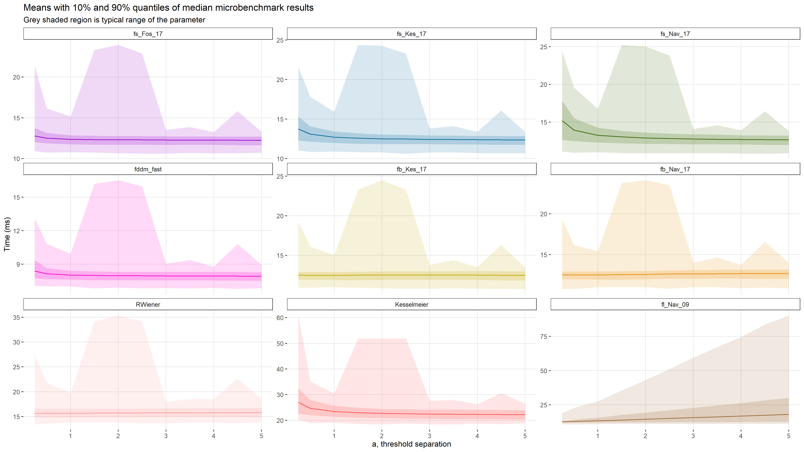
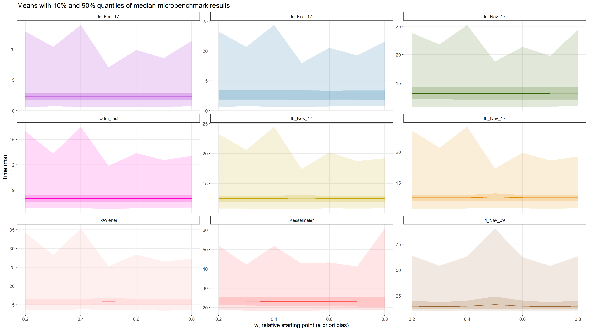

```{r setup, include=FALSE}
knitr::opts_chunk$set(echo = TRUE)
```

# Example Uses for dfddm {.tabset .tabset-fade}

`dfddm` is a density function for the Ratcliff diffusion decision model (DDM) with following parameters: `a` (threshold separation), `v` (drift rate), `t0` (non-decision time/response time constant), `w` (relative starting point), and `sv` (inter-trial-variability of drift).


## Benchmark Tests

This section shows the results of the benchmark tests.

We want to determine the performance of each method across a wide variety of parameters in order to identify any slow areas for individual methods. To achieve this rigor, we define an extensive parameter space (in full in the code chunk below) and loop through each combination of parameters. We have two different ways of inputting the response times to the functions: either as a vector of response times or as individual response times. For each combination, we run `microbenchmark` 10,000 times for each method and only save the median benchmark time of these 10,000. The following code chunk runs the full benchmark tests, but this takes a looooong while so we'll just read the data from file later on.
```{r bm-run, eval=FALSE}
source("code/benchmark_functions.r")

# Define parameter space
RT_0_30 = c(0.001, 0.005, 0.01, 0.05, 0.1,
            seq(0.5, 3, by = 0.5),
            seq(4, 10, by = 1),
            seq(12.5, 20, by = 2.5),
            seq(25, 30, by = 5))
RT_0_3 = c(0.001, 0.005, 0.01, 0.05, 0.1,
           seq(0.5, 3, by = 0.5))
RT_4_10 = seq(4, 10, by = 1)
RT_12_30 = c(seq(12.5, 20, by = 2.5),
             seq(25, 30, by = 5))
A = c(0.25, seq(0.5, 5, by = 0.5))
V = seq(-6, 6, by = 0.5)
t0 = 1e-4 # must be nonzero for RWiener
W = seq(0.2, 0.8, by = 0.1)
err_tol = 1e-6 # this is the setting from rtdists

# Run benchmark tests
sim <- rt_benchmark(RT = RT_4_10, resp = 0, V = V, A = A, W = W, t0 = t0,
                    err_tol = err_tol, rt_as_vec = FALSE,
                    times = 10000, unit = "us")
saveRDS(sim, file = "data/sim_4-10_10000.Rds")

sim_vec <- rt_benchmark(RT = c(RT_0_3, RT_4_10), resp = 0, V = V, A = A, W = W, t0 = t0,
                        err_tol = err_tol, rt_as_vec = TRUE,
                        times = 10000, unit = "us")
saveRDS(sim_vec, file = "data/vec_0-10_10000.Rds")
```

<br>
The first step in analyzing the benchmark data is to visualize the results in side-by-side violin plots. We read the results data from the file and plot a violin for each method investigated. For this visualization we will use the benchmark data where the response times are input as a vector to each function; this should help the the mainly `R`-based functions operate more efficiently because of `R`'s use of vectorization. The following code chunk saves violin plots of the benchmark results (can take a short while).
```{r bm-violin, eval=FALSE}
library("reshape2")
library("ggplot2")

bm <- readRDS("data/vec_0-10_10000.Rds")
t_idx <- match("W", colnames(bm))
bm[,-seq_len(t_idx)] <- bm[, -seq_len(t_idx)]/1000
mbm <- melt(bm, measure.vars = -seq_len(t_idx),
            variable.name = "FuncName", value.name = "time")

Names <- c("fddm_fast", "fs_Fos_17", "fs_Fos_14",
           "fs_Kes_17", "fs_Kes_14", "fs_Nav_17", "fs_Nav_14",
           "fb_Kes_17", "fb_Kes_14", "fb_Nav_17", "fb_Nav_14",
           "fl_Nav_09", "RWiener", "Kesselmeier", "rtdists")
Color <- c("#ff00cc", "#9900cc", "#cc99ff",
           "#006699", "#66ccff", "#336600", "#33cc33",
           "#c2a500", "#d7db42", "#e68a00", "#ffb366",
           "#996633", "#ff9999", "#ff5050", "#990000")

violin <- ggplot(mbm, aes(x = FuncName, y = time,
                          color = factor(FuncName, levels = Names),
                          fill = factor(FuncName, levels = Names))) +
                 geom_violin(trim = TRUE, alpha = 0.5) +
                 scale_color_manual(values = Color) +
                 scale_fill_manual(values = Color) +
                 geom_boxplot(width = 0.15, fill = "white", alpha = 0.5) +
                 stat_summary(fun.y = mean, geom = "errorbar",
                              aes(ymax = ..y.., ymin = ..y..),
                              width = .35, linetype = "dashed") +
                 # abline
                 coord_cartesian(ylim = c(0,50)) +
                 labs(title = "Distribution of median benchmark times",
                      subtitle = "Dashed lines represent mean benchmark times",
                      x = "Method", y = "Time (ms)",
                      color = "Method") +
                 theme_bw() +
                 theme(panel.border = element_blank(),
                       plot.title = element_text(size = 23),
                       plot.subtitle = element_text(size = 16),
                       axis.text.x = element_text(size = 16, angle = 30),
                       axis.text.y = element_text(size = 16),
                       axis.title.x = element_text(size = 20),
                       axis.title.y = element_text(size = 20),
                       legend.position = "none")
ggsave("data/images/violin/violin_0-10_vec.png", plot = violin,
       width = 16, height = 9)
```

<center>

**Figure 1.** Violin plots for each method using a vector of response times as input.
</center>


<br><br>
A simple density plot for each method reveals whether or not a method has troublesome , but not where these troubles are. To visualize this phenomenon for each method, we can plot that method's median benchmark times as a result of each parameter. This will allow us to see where in the parameter space each method is efficient and where it is not efficient. The following code chunk generates and saves plots of the benchmark results (can take a short time).
```{r bm-meq, eval=FALSE}
library("reshape2")
library("ggplot2")
library("tidyverse")

bm <- readRDS("data/sim_0-10_10000.Rds")
t_idx <- match("W", colnames(bm))
bm[,-seq_len(t_idx)] <- bm[, -seq_len(t_idx)]/1000
mbm <- melt(bm, measure.vars = -seq_len(t_idx),
            variable.name = "FuncName", value.name = "time")

Names_meq <- c("fs_Fos_17", "fs_Kes_17", "fs_Nav_17",
               "fddm_fast", "fb_Kes_17", "fb_Nav_17",
               "RWiener", "Kesselmeier", "fl_Nav_09")
Color_meq <- c("#9900cc", "#006699", "#336600",
               "#ff00cc", "#c2a500", "#e68a00",
               "#ff9999", "#ff5050", "#996633")
mbm_meq <- subset(mbm, FuncName %in% Names_meq)

# RT
mbm_meq %>%
  mutate(FuncName = factor(FuncName, levels = Names_meq)) %>%
  group_by(FuncName, RT) %>%
  summarise(means = mean(time),
            upper = quantile(time, prob = 0.9),
            lower = quantile(time, prob = 0.1),
            max = max(time),
            min = min(time)) %>%
  ggplot(aes(x = RT, y = means, color = FuncName)) +
  geom_ribbon(aes(ymin = lower, ymax = upper, fill = FuncName),
              alpha = 0.2, color = NA) +
  geom_ribbon(aes(ymin = min, ymax = max, fill = FuncName),
              alpha = 0.15, color = NA) +
  geom_line(aes(group = 1)) +
  scale_color_manual(values = Color_meq) +
  scale_fill_manual(values = Color_meq) +
  labs(title = "Means with 10% and 90% quantiles of median microbenchmark results",
       x = "rt, response time", y = "Time (ms)") +
  theme_bw() +
  theme(panel.grid.minor = element_blank(),
        panel.border = element_blank(),
        strip.background = element_rect(fill = "white"),
        legend.position = "none") +
  facet_wrap("FuncName", scales = "free_y")
ggsave("data/images/meq/meq_RT_0-10.png",
       width = 16, height = 9)

# A
mbm_meq %>%
  mutate(FuncName = factor(FuncName, levels = Names_meq)) %>%
  group_by(FuncName, A) %>%
  summarise(means = mean(time),
            upper = quantile(time, prob = 0.9),
            lower = quantile(time, prob = 0.1),
            max = max(time),
            min = min(time)) %>%
  ggplot(aes(x = A, y = means, color = FuncName)) +
  geom_ribbon(aes(ymin = lower, ymax = upper, fill = FuncName),
              alpha = 0.2, color = NA) +
  geom_ribbon(aes(ymin = min, ymax = max, fill = FuncName),
              alpha = 0.15, color = NA) +
  geom_line(aes(group = 1)) +
  scale_color_manual(values = Color_meq) +
  scale_fill_manual(values = Color_meq) +
  labs(title = "Means with 10% and 90% quantiles of median microbenchmark results",
       subtitle = "Grey shaded region is typical range of the parameter",
       x = "a, threshold separation", y = "Time (ms)") +
  theme_bw() +
  theme(panel.grid.minor = element_blank(),
        panel.border = element_blank(),
        strip.background = element_rect(fill = "white"),
        legend.position = "none") +
  facet_wrap("FuncName", scales = "free_y")
ggsave("data/images/meq/meq_A_0-10.png",
       width = 16, height = 9)

# V
mbm_meq %>%
  mutate(FuncName = factor(FuncName, levels = Names_meq)) %>%
  group_by(FuncName, V) %>%
  summarise(means = mean(time),
            upper = quantile(time, prob = 0.9),
            lower = quantile(time, prob = 0.1),
            max = max(time),
            min = min(time)) %>%
  ggplot(aes(x = V, y = means, color = FuncName)) +
  geom_ribbon(aes(ymin = lower, ymax = upper, fill = FuncName),
              alpha = 0.2, color = NA) +
  geom_ribbon(aes(ymin = min, ymax = max, fill = FuncName),
              alpha = 0.15, color = NA) +
  geom_line(aes(group = 1)) +
  scale_color_manual(values = Color_meq) +
  scale_fill_manual(values = Color_meq) +
  labs(title = "Means with 10% and 90% quantiles of median microbenchmark results",
       subtitle = "Grey shaded region is typical range of the parameter",
       x = "v, drift rate", y = "Time (ms)") +
  theme_bw() +
  theme(panel.grid.minor = element_blank(),
        panel.border = element_blank(),
        strip.background = element_rect(fill = "white"),
        legend.position = "none") +
  facet_wrap("FuncName", scales = "free_y")
ggsave("data/images/meq/meq_V_0-10.png",
       width = 16, height = 9)

# W
mbm_meq %>%
  mutate(FuncName = factor(FuncName, levels = Names_meq)) %>%
  group_by(FuncName, W) %>%
  summarise(means = mean(time),
            upper = quantile(time, prob = 0.9),
            lower = quantile(time, prob = 0.1),
            max = max(time),
            min = min(time)) %>%
  ggplot(aes(x = W, y = means, color = FuncName)) +
  geom_ribbon(aes(ymin = lower, ymax = upper, fill = FuncName),
              alpha = 0.2, color = NA) +
  geom_ribbon(aes(ymin = min, ymax = max, fill = FuncName),
              alpha = 0.15, color = NA) +
  geom_line(aes(group = 1)) +
  scale_color_manual(values = Color_meq) +
  scale_fill_manual(values = Color_meq) +
  labs(title = "Means with 10% and 90% quantiles of median microbenchmark results",
       x = "w, relative starting point (a priori bias)", y = "Time (ms)") +
  theme_bw() +
  theme(panel.grid.minor = element_blank(),
        panel.border = element_blank(),
        strip.background = element_rect(fill = "white"),
        legend.position = "none") +
  facet_wrap("FuncName", scales = "free_y")
ggsave("data/images/meq/meq_W_0-10.png",
       width = 16, height = 9)
```

<center>

<br><br>

<br><br>

<br><br>

<br>
**Figure 2.** Plots showing the benchmark times as a result of parameter values.
</center>


## Fitting to Data

This section shows an example of how to use `dfddm` to fit the Ratcliff DDM to data.


</div>
## {-}
#### R Session Info
```{r session-info, collapse=TRUE}
sessionInfo()
```
